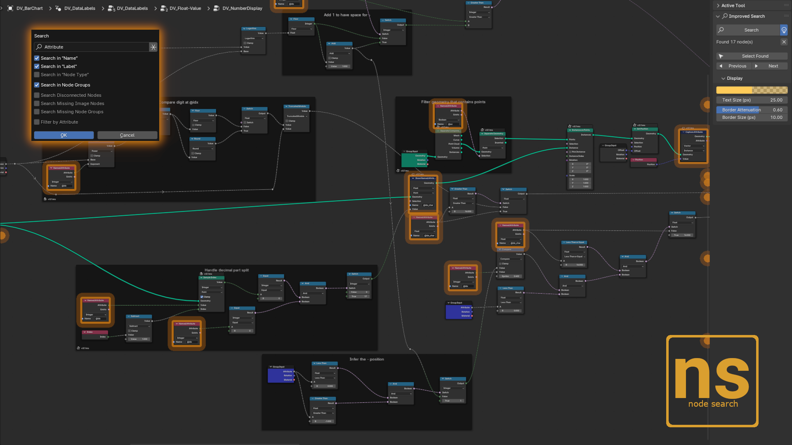
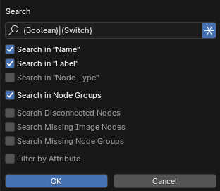
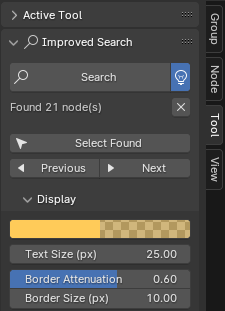

# Blender Improved Node Search

    
    

    <!-- <a href="https://blendermarket.com/products/data-visualisation-addon">Blender Market</a> | -->
    <!-- <a href="https://griperis.gumroad.com/l/data-vis">Gumroad</a> | -->
    <!-- <a href="">Extensions</a> -->
    <a href="https://www.buymeacoffee.com/griperis">Buy me a coffee</a>

Empowering the node tree search by providing various search options and highlighting the found nodes or occurrences in a node group.

The tool is located in the **node tree sidebar** (N-Panel) in the **Tool** panel. The extension replaces the default CTRL+F search shortcut, you can customize the shortcut in Blender Preferences.
The extension works in Shader, Geometry, Compositor and any other node tree.

## Search options
The extension brings **text search** inside multiple node properties. Text search has also option for **regular expression** search. For geometry nodes you can also **search** through **attributes**.

| Option    | Description |
| -------- | ------- |
| Name  | Search in names of nodes |
| Label | Search in labels of nodes  |
| Type    | Search in the blidname property    |

Additionally the extension can help you with identifying problems in your node trees using non text search options.

| Option    | Description |
| -------- | ------- |
| Disconnected Nodes  | Finds nodes that do not connect to anything, but have outputs|
| Missing Image Nodes | Finds image nodes that do not have image or whose image is invalid  |
| Missing Node Groups    | Finds node groups with empty node trees (Missing DNA block error)    |

Found nodes can be selected, or navigated one by one using the `Select Found`, `Previous` and `Next` buttons.

    
    

## Display options
Found nodes are highlighted by a border if onscreen or a circle indicating location of the found node is displayed if the node is off-screen. The overlay can be toggled on and off by the `Bulb Icon` next to `Search` 

Occurences in node group are indicated by a number displayed next to the node. The display can be customized by changing the `Highlight Color`, `Border Attenuation` and `Text Size`.

Display options are located in the `Display` subpanel.